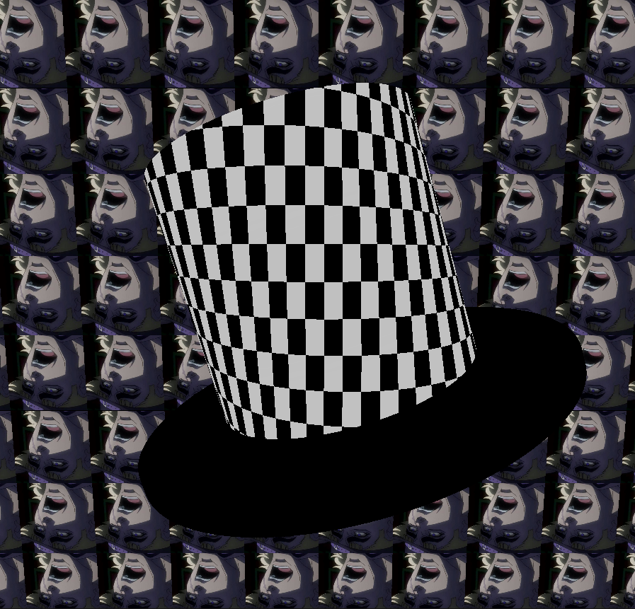

# MINIRT - Raytracing project
This project is a simple raytracing project that renders 3D scenes using the raytracing algorithm. <br>
The project is written in C and uses the minilibx library for the graphical output.


 <br>

## Features
- Rendering of spheres, planes, cylinder and cones.
- Shadows
- specular / difussed lighting
- checkboard texture
- texture mapping
- normal mapping
- multi-light support

## Installation and usage
1. Clone the repository
```bash
git clone   git@github.com:n1smm/MiniRT-miniRaytracer.git
```
2. Run the make command
```bash
make
```
3. Run the executable
```bash
./miniRT scenes/<scene.rt>
```
4. change the <scene.rt> to any of the scenes in the scenes folder or <br>
create your own scene file using the following format:
```bash
A 0.5   5,5,5 # ambient light <intensity> <r,g,b> 
C 0,0,-40 0,0,1 80 # camera <position> <direction> <fov>
L -20,5,0   0.5   255,255,255 # directional light <position> <intensity> <r,g,b>
sp 0,0,0 20 255,0,30 # sphere <position> <diameter> <r,g,b>
pl 0,-10,0   0,1,0   40,40,40 # object <position> <normal> <r,g,b>
```
5. for bonus features use the following format:
```bash
l 0,0,0 0.5 255,255,255 # point light <position> <intensity> <r,g,b> (can add more)
pic PATH:textures/speedwagon.xpm # texture <path>
pic PATH:textures/speedwagon_normal.xpm # normal map <path>
sp 0,0,0 20 255,0,30 1 0 1 # sphere <position> <diameter> <r,g,b> <checkerboard/bool> <texture/indexOfImg> <normal map/indexOfImg>
```
# Examples
 <br>
 <br>
 <br>
 <br>
 <br>
